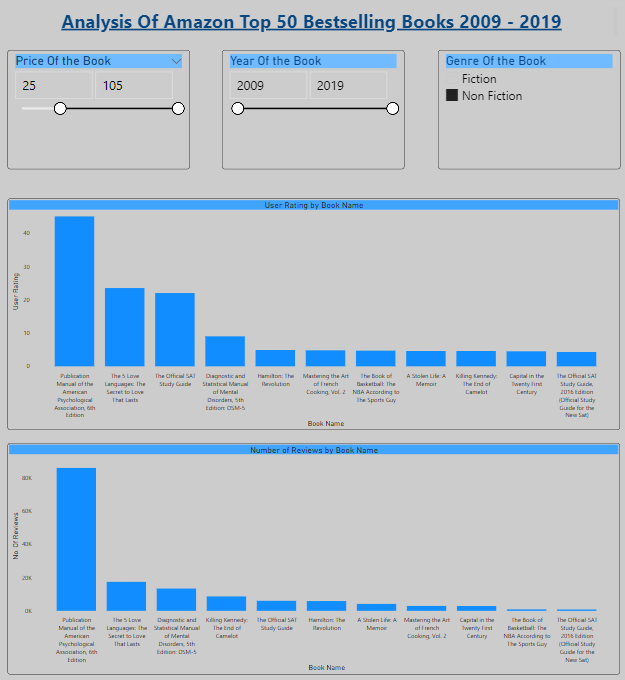

# Microsoft PowerBI Projects

## Project 1: Amazon Bestselling Books Analysis

1 This dashboard has three filters: Price of the book, Year of the book and Genre of the book.

2 This dashboard can be used to view:
  - Top books by user rating
  - Top books with highest number of reviews

[Dashboard](https://github.com/shikhar0503/Power-BI-Dashboards/Amazon_Bestselling_Books_Analysis_Dashboard)

## Project 2: E-Commerce Sales Analysis

1 This dashboard has one filter: Year  

2 This dashboard can be used to view:
  - Top 10 profitable and loss making products.
  - Sales division by markets.
  - Profit by customer name.

[Dashboard](https://github.com/shikhar0503/Power-BI-Dashboards/E-Commerce_Sales_Analysis_Dashboard)

## Project 3: Food Sales Analytics

1 This dashboard can be used to view:
  - The Seasonal trends in sales data over the last three years.
  - The Key Performance Indicators (KPI) for generating revenue and orders over the last three years.
  - The Product Categories, Product Groups and Channels that generate more Revenue and Sales and the least contributors.
  - The Top 5 Salespersons by Revenue and Orders.
  - The Top Ranking Salespersons based on their performance.
 

[Dashboard](https://github.com/shikhar0503/Power-BI-Dashboards/Food_Sales_Analytics_Dashboard)

## Project 4: Human Resource Analysis

1 This dashboard has five pages: Home, Salary Analysis, Hire & Termination, Breakdown, Dashboard

2 This dashboard can be used to view:
  - Salary Analysis inside the organisation for given years
  - Hire & Termination ratio inside the organisation for given years with their working location
  - Breakdown of the employees working in the organisation.

[Dashboard](https://github.com/shikhar0503/Power-BI-Dashboards/Human_Resource_Dashboard)

## Project 5: Video Game Analysis 

1 This dashboard has four filters: Game's genre, publish, platform type and release year.

2 This dashboard can be use to view:
- Total Sales in Global Market, Europe, North America, Rest of the World and Japan
- Top 15 Countries in terms of Global Sales.
 

[Dashboard](https://github.com/shikhar0503/Power-BI-Dashboards/Video_Games_Analysis_Dashboard)

## License
**Copyright 2022 Shikhar Katyayan**

Licensed under the Apache License, Version 2.0 (the "License"); you may not use this file except in compliance with the License. Unless required by applicable law or agreed to in writing, software distributed under the License is distributed on an "AS IS" BASIS, WITHOUT WARRANTIES OR CONDITIONS OF ANY KIND, either express or implied. See the License for the specific language governing permissions and limitations under the License.
